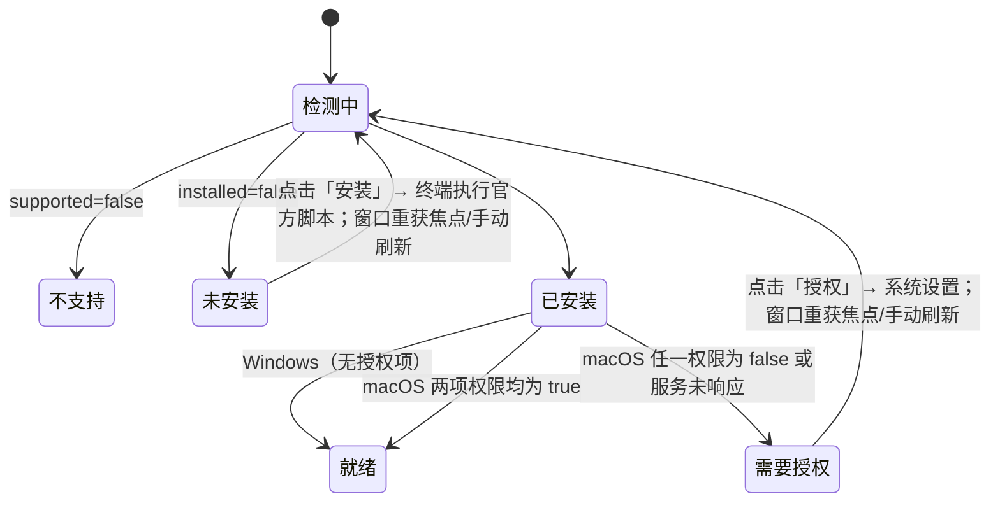

# 电脑控制（Computer Use）：接入 Kimi Computer Use

## 背景

- 开源版的 `@zcode/zcode-cua` 是占位包：Helper、broker、PiP 全部返回不可用，
  官方插件 `computer-use@zcode-plugins-official` 的种子目录（`zcode-cua-plugin`）也不在仓库中，
  设置里的「电脑控制」开关打开后没有任何可用工具。
- Kimi Computer Use（KimiCU）是 Moonshot AI 提供的桌面自动化 MCP server（macOS / Windows x64）。macOS 版：
  `KimiCU.app/Contents/MacOS/kimi-cu mcp`（stdio），读取无障碍树 + 截图，后台注入点击/输入/滚动/拖拽，
  不移动真实鼠标、不切前台。以 `zcode` 客户端身份握手与调用已验证可用（0.5.11，11 个工具）。
- Windows 版为 `kimi-cu.exe mcp`，官方 `setup_windows.ps1` 按用户安装到 `%LOCALAPPDATA%\KimiCU`，
  校验运行时 SHA-256 与 Authenticode 签名；执行操作时会短暂占用键盘鼠标，无系统级授权项。
- KimiCU 为闭源（Proprietary）程序，ZCode 不分发二进制，只调用官方安装脚本由用户在可见的终端窗口安装：
  macOS `setup_macos.sh`，Windows `setup_windows.ps1`（均在 `cdn.kimi.com`）。

## 目标

1. 用 Kimi Computer Use 替换官方「电脑控制」插件的内容，保留原有插件身份（`computer-use@zcode-plugins-official`）、
   设置入口与启用开关，同事安装 ZCode 后开启插件即可使用。
2. KimiCU 未安装时，设置页提供「安装」入口（打开系统终端执行官方安装脚本），并展示授权状态。
3. 模型侧只新增一组标准 MCP 工具与一个使用技能，不改 Agent 核心逻辑。

## 暂不包含

- Linux（KimiCU 无 Linux 版）。
- 删除占位 CUA 的 Helper / 权限 / PiP 代码（与宿主生命周期交织，保持闲置）。
- 远端 Workspace：电脑控制只作用于运行 Host 的本机。

## 插件结构

```text
apps/zcode-cli/packages/computer-use-plugin/
  package.json                   type=module，保证 server.js 在源码与 seed 缓存中都按 ESM 加载
  .zcode-plugin/plugin.json      name=computer-use，skills=skills，mcpServers.kimi-cu
  dist/mcp/server.js             手写启动器（纳入版本管理），导出 main()：定位 KimiCU，
                                 以继承的 stdio spawn `kimi-cu mcp`；未安装时 stderr 给出安装指引
  scripts/install-kimi-cu.sh     macOS 官方安装脚本调用
  scripts/install-kimi-cu.ps1    Windows 官方安装脚本调用
  skills/computer-use/SKILL.md   工作流、安全守则、排障
  docs/computer-use.md           面向用户的说明
```

- 启动方式：官方插件 seed 时 `writeOfficialPluginRuntimeManifest` 把 manifest 中的 MCP 改写为
  `<ZCode 自带 Node> [execArgv] <cli 入口> __zcode-plugin-host <root>/dist/mcp/server.js`（带 `ELECTRON_RUN_AS_NODE=1`），
  因此不依赖系统 shell 或 PATH 中的 node，macOS 与 Windows 共用一份启动器。
- 可执行文件探测顺序（插件启动器与 Host 服务一致）：
  - macOS：`/Applications/KimiCU.app`、`~/Applications/KimiCU.app`。
  - Windows：`%KIMI_CU_WINDOWS_EXE%`、`%KIMI_CU_WINDOWS_HOME%\kimi-cu.exe`、`%LOCALAPPDATA%\KimiCU\kimi-cu.exe`、
    `%ProgramFiles%\KimiCU\kimi-cu.exe`。
- `kimi-cu` 带有官方电脑控制插件的 plugin id，`mcp-config.ts` 的旧 zcode-cua 退役过滤需豁免该名称。
- 官方插件定义：`rootCandidates` 指向 `computer-use-plugin`；`requiredSeedPaths` 改为上述文件；
  移除 `hostMcpServerNames: ["node_repl"]`。
- 运行时解耦占位 CUA：`computer-use` 启用时不再注入 `ZCODE_CUA_PLUGIN_ROOT`、不再单独拉起 node_repl、
  不再设置 `runtimeFeatures.computerUse`。
- 打包：桌面 `prepare-agent-node-bundle.mjs` 与 CLI SEA 清单加入该插件（纯资源，无需构建）。

## Host 服务：`IKimiComputerUseService`（channel `kimi-computer-use`）

```ts
getStatus(): Promise<KimiComputerUseStatus>
openInstaller(): Promise<void>        // macOS：osascript 让「终端」执行；Windows：新 PowerShell 窗口执行
requestPermissions(): Promise<void>   // 仅 macOS：kimi-cu request-permissions --ax --screen
```

```ts
type KimiComputerUseStatus =
  | { supported: false }                                   // 非 macOS / Windows
  | { supported: true; platform: "macos" | "windows"; installed: false }
  | { supported: true; platform: "macos" | "windows"; installed: true; version?: string;
      permissions: { accessibility: boolean; screenRecording: boolean } | null };
      // macOS：null=服务未响应；Windows：恒为 null（无授权项）
```

- 版本：macOS 读 `Contents/Info.plist` 的 `CFBundleShortVersionString`（`plutil`），
  Windows 读安装目录 `version.json` 的 `version`；失败时省略。
- 权限以 `kimi-cu xpc-ping` 为准（权限由 launchd 服务持有，不能用调用方进程判断），
  输出 `permissionStatus: accessibility=<bool> screenRecording=<bool>`；超时 8s 或无法解析时为 `null`。
- 安装需要用户可见、可输入密码（`/Applications` 不可写时脚本会 sudo），因此不在 Host 后台静默执行。

## 设置页



- 「启用电脑控制」开关与「在输入框显示电脑操作按钮」保留，行为不变（启用官方插件）。
- 原 ZCode Helper 权限卡片替换为 KimiCU 状态卡片：安装状态与版本、「安装」「刷新」按钮，
  并注明 KimiCU 由 Moonshot AI 提供。macOS 另有辅助功能/屏幕录制两项权限与「授权」按钮；
  Windows 提示执行时会短暂占用键盘鼠标。远端 workspace 显示不支持。

## 验收

- 未安装 KimiCU：设置页显示「未安装」与安装按钮，点击后系统终端开始执行官方安装脚本。
- 已安装且已授权：开启插件后新对话可调用 `list_apps` 等工具，模型能按技能完成「打开某 app 并读取界面」。
- 未开启插件时不注册 kimi-cu MCP，不启动任何 KimiCU 进程。
