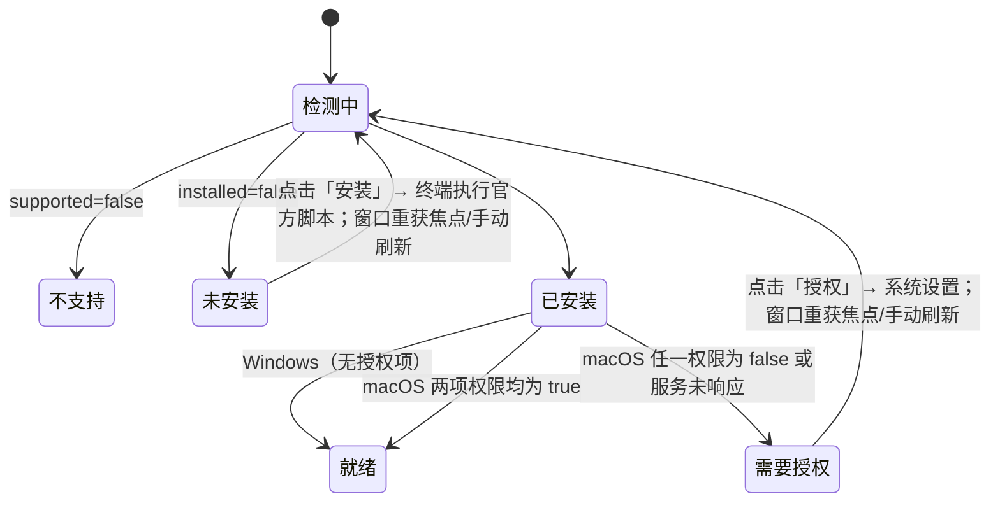

# 电脑控制（Computer Use）：接入 Kimi Computer Use

## 背景

- 开源版的 `@zcode/zcode-cua` 是占位包：Helper、broker、PiP 全部返回不可用，
  官方插件 `computer-use@zcode-plugins-official` 的种子目录（`zcode-cua-plugin`）也不在仓库中，
  设置里的「电脑控制」开关打开后没有任何可用工具。
- Kimi Computer Use（KimiCU）是 Moonshot AI 提供的桌面自动化 MCP server（macOS / Windows x64）。macOS 版：
  `KimiCU.app/Contents/MacOS/kimi-cu mcp`（stdio），读取无障碍树 + 截图，后台注入点击/输入/滚动/拖拽，
  不移动真实鼠标、不切前台。以 `zcode` 客户端身份握手与调用已验证可用（0.5.11，11 个工具）。
- Windows 版为 `kimi-cu.exe mcp`，官方 `setup_windows.ps1` 按用户安装到 `%LOCALAPPDATA%\KimiCU`，
  校验运行时 SHA-256 与 Authenticode 签名；执行操作时会短暂占用键盘鼠标，无系统级授权项。
- KimiCU 为闭源（Proprietary）程序，ZCode 不分发二进制，只调用官方安装脚本由用户在可见的终端窗口安装：
  macOS `setup_macos.sh`，Windows `setup_windows.ps1`（均在 `cdn.kimi.com`）。

## 目标

1. 用 Kimi Computer Use 替换官方「电脑控制」插件的内容，保留原有插件身份（`computer-use@zcode-plugins-official`）、
   设置入口与启用开关，同事安装 ZCode 后开启插件即可使用。
2. KimiCU 未安装时，设置页提供「安装」入口（打开系统终端执行官方安装脚本），并展示授权状态。
3. 模型侧只新增一组标准 MCP 工具与一个使用技能，不改 Agent 核心逻辑。

## 暂不包含

- Linux（KimiCU 无 Linux 版）。
- 删除占位 CUA 的 Helper / 权限代码（与宿主生命周期交织，保持闲置）。
- 用 Kimi 的 `get_app_state` JPEG 驱动预览窗（那是给模型的观察，与预览并行）。
- 把预览帧写入对话或模型上下文。
- 远端 Workspace：电脑控制只作用于运行 Host 的本机。

## 电脑控制预览窗（对齐闭源 Auto-PiP 的产品语义）

闭源 3.14.1 的跟看窗不在 Electron 主程序里：独立 Helper（`dev.zcode.cua-helper`）用 ScreenCaptureKit 采目标窗口，并用 `NSPanel` 展示。Host 只发 `pip_session` 生命周期。开源 Helper/PiP client 是空壳，KimiCU 也不提供对等展示协议。

本仓库恢复的是**同一套产品语义**，展示端改由 Desktop Main 持有，不复活闭源 Helper，不把窗放进 `computer-use` 插件：

```text
kimi-cu 工具 tool-started
  → Host tracker 将 turn 标为 computer-use active
  → Main 亮预览窗（showInactive，不抢焦点）
  → 后续：Main 按 pid/窗口身份捕获该窗口并刷新预览
  → turn 结束 / 失败 / 会话关闭 → 关窗
```

### 所有者

- **判定**：Agent bootstrap 在 `computer-use/operation-event` 的 `tool-scheduled` 上标记 `computerUse: true`。认 `kimi-cu`（含 `plugin:computer-use:kimi-cu` 命名空间）以及旧 `computer-use` / `setupComputerUseRuntime` 回放路径。
- **聚合**：Host `cuaOperationTurnTracker`。亮窗时机仍是第一个电脑控制工具 **真正开始执行**（`tool-started`），不是 `turn-started`（可能还卡在权限框）。
- **窗与捕获**：Desktop Main。Main 是预览窗和（后续）捕获会话的唯一所有者。Host 只上报 turn 活跃/空闲，不持有窗口。
- **KimiCU**：只负责操作桌面，并在工具参数里给出目标 `pid` / `app` / `window_id`。不画窗、不向预览通道推 JPEG。

### 事件顺序

```text
turn-started（只记账，不亮窗）
  → tool-scheduled（computerUse: true）
  → tool-started（turn active → Main 亮窗）
  → 同 turn 后续电脑控制工具（刷新兜底计时，不重建窗）
  → turn-completed / turn-failed / session-closed（idle → 关窗）
```

远端 Host / 非 `desktop-local` 不得把 turn 投影到本机屏幕。macOS 与 Windows 本机桌面都应上报操作态；Linux 不展示。

### 预览窗行为

- **贴在对话窗旁边**：锚点是承载该 Host 进程的对话窗（多个时取聚焦的那个）。右侧放得下放右侧，
  否则左侧，都放不下（对话窗铺满屏幕）时收进对话窗右上角；对话窗移动、缩放、最小化时跟随。
  找不到锚点或对话窗最小化时退回鼠标所在屏幕顶部居中。
- `showInactive`、always-on-top、跳过任务栏、不抢用户焦点。
- 把自己排除在捕获源之外（`setContentProtection`）。
- 无目标窗口身份时仍亮空壳，不要猜整屏。
- 帧只进人看的预览窗，不进 MCP 结果、不进 token。

### 目标窗口身份

`tool-scheduled` 在 `computerUse: true` 时附带可选 `computerUseTarget`（从 kimi-cu 工具参数读取，不解析动作名）：

- `pid`：进程 id（首选）
- `app`：bundle id
- `windowId`：Kimi 的 AX `window_id`，**不等于** `CGWindowID`；仅作消歧线索

Host tracker 在 `tool-started` 把该身份写入本机操作态；同 turn 内后续电脑控制工具可更新身份。Main 只消费 Host 已判定的字段。

### 目标解析

KimiCU 所有工具的 `pid` 都是可选的，可以只传 `app`。技能要求模型传 `list_apps` 给出的 `pid`，Main 侧仍兜底解析：

- 预览跟随最近一次电脑控制操作所在 turn 的目标身份；同一 turn 内后续工具可更新身份。
- 身份变化但解析到同一窗口时（先传 `app` 后传 `pid`）不重启流。
- 解析失败或流中断（窗口关闭 / 重建）时每 1.5s 重试，最多 4 次，之后保持空壳直到目标变化。

### 捕获（macOS）：ScreenCaptureKit 辅助程序

`packages/desktop/native/macos-cua-preview/main.swift` → `resources/macos-cua-preview/zcode-cua-preview`（universal，最低 macOS 12.3）：

```text
resolve [--pid] [--app 显示名/bundle id/可执行名] [--window-id]
  → NSWorkspace 把 app 解析成 pid
  → SCShareableContent（onScreenWindowsOnly=false）列该 pid 的 layer-0 窗口
  → windowId 命中优先；否则屏幕上面积最大者；都不在屏幕上（其他桌面空间）时取有标题的最大窗口
stream --window-id <CGWindowID> --fps 10 --max-width 640
  → SCContentFilter(desktopIndependentWindow:) + SCStream，被遮挡也能采到
  → 只转发完整帧（静止窗口不产生流量），stdout 输出 4 字节大端长度 + JPEG
  → 每 1.5s 核对窗口尺寸并更新输出尺寸；窗口消失以 5 退出；stdin 关闭即退出
```

- 录屏权限挂在 **ZCode.app**（辅助程序是其子进程），与 KimiCU 的 TCC 分开。未授权或匹配失败时保持空壳，不回退 Kimi JPEG。
- 最小化的窗口系统层面无法采集，保持空壳。

### 捕获（Windows）：Chromium getDisplayMedia（Windows.Graphics.Capture）

```text
PowerShell：pid → 进程；或 app（进程名 / 主窗口标题 / 描述）→ 进程 → MainWindowHandle
  → KimiCU window_id ≥ 0x10000 时先当作 HWND 试
  → desktopCapturer.getSources（缩略图 0×0，只取 id）找 `window:<HWND>:`
  → 预览页以 userGesture 调 getDisplayMedia；预览窗独立内存分区 `cua-preview` 的
    setDisplayMediaRequestHandler 直接交出该 source，不弹选择器
  → <video> 实时播放；轨道结束（窗口关闭）即回到空壳
```

- 预览页必须是安全上下文，故写入 `userData/computer-use-preview/*.html` 后以 file:// 加载（data: URL 没有 `navigator.mediaDevices`）。

## 插件结构

```text
apps/zcode-cli/packages/computer-use-plugin/
  package.json                   type=module，保证 server.js 在源码与 seed 缓存中都按 ESM 加载
  .zcode-plugin/plugin.json      name=computer-use，skills=skills，mcpServers.kimi-cu
  dist/mcp/server.js             手写启动器（纳入版本管理），导出 main()：定位 KimiCU，
                                 以继承的 stdio spawn `kimi-cu mcp`；未安装时 stderr 给出安装指引
  scripts/install-kimi-cu.sh     macOS 官方安装脚本调用
  scripts/install-kimi-cu.ps1    Windows 官方安装脚本调用
  skills/computer-use/SKILL.md   工作流、安全守则、排障
  docs/computer-use.md           面向用户的说明
```

- 启动方式：官方插件 seed 时 `writeOfficialPluginRuntimeManifest` 把 manifest 中的 MCP 改写为
  `<ZCode 自带 Node> [execArgv] <cli 入口> __zcode-plugin-host <root>/dist/mcp/server.js`（带 `ELECTRON_RUN_AS_NODE=1`），
  因此不依赖系统 shell 或 PATH 中的 node，macOS 与 Windows 共用一份启动器。
- 可执行文件探测顺序（插件启动器与 Host 服务一致）：
  - macOS：`/Applications/KimiCU.app`、`~/Applications/KimiCU.app`。
  - Windows：`%KIMI_CU_WINDOWS_EXE%`、`%KIMI_CU_WINDOWS_HOME%\kimi-cu.exe`、`%LOCALAPPDATA%\KimiCU\kimi-cu.exe`、
    `%ProgramFiles%\KimiCU\kimi-cu.exe`。
- `kimi-cu` 带有官方电脑控制插件的 plugin id。`mcp-config.ts` 已移除旧 zcode-cua 退役过滤，插件 MCP 按运行时命名空间名 `plugin:computer-use:kimi-cu` 原样连接。
- `kimi-cu` 是可信 CUA：来源由插件注册表对象身份 + resolver 写入的 plugin id 校验（无 broker authority），
  享有旧官方 CUA 的全部特权——模型可见名投影为 `mcp__computer-use__*`（含 `mcp__computer_use__*` 别名）、
  `official_cua` 项目级权限组、256 KiB 结果预算、`get_app_state` 必填 title、官方 CUA 结果展示、子代理内禁用。
  唯一例外是 zcode-cua 帧契约（`modelContentProtection` / `preserveOfficialCuaFrames`）：KimiCU 不签发帧凭据，
  开源占位的 attest 恒 fail-closed，挂上会让带图结果全部报错，故不挂。
- 官方插件定义：`rootCandidates` 指向 `computer-use-plugin`；`requiredSeedPaths` 改为上述文件；
  移除 `hostMcpServerNames: ["node_repl"]`。
- 运行时解耦占位 CUA：`computer-use` 启用时不再注入 `ZCODE_CUA_PLUGIN_ROOT`、不再单独拉起 node_repl、
  不再设置 `runtimeFeatures.computerUse`。
- 打包：桌面 `prepare-agent-node-bundle.mjs` 与 CLI SEA 清单加入该插件（纯资源，无需构建）。

## Host 服务：`IKimiComputerUseService`（channel `kimi-computer-use`）

```ts
getStatus(): Promise<KimiComputerUseStatus>
openInstaller(): Promise<void>        // macOS：osascript 让「终端」执行；Windows：新 PowerShell 窗口执行
requestPermissions(): Promise<void>   // 仅 macOS：kimi-cu request-permissions --ax --screen
```

```ts
type KimiComputerUseStatus =
  | { supported: false }                                   // 非 macOS / Windows
  | { supported: true; platform: "macos" | "windows"; installed: false }
  | { supported: true; platform: "macos" | "windows"; installed: true; version?: string;
      permissions: { accessibility: boolean; screenRecording: boolean } | null };
      // macOS：null=服务未响应；Windows：恒为 null（无授权项）
```

- 版本：macOS 读 `Contents/Info.plist` 的 `CFBundleShortVersionString`（`plutil`），
  Windows 读安装目录 `version.json` 的 `version`；失败时省略。
- 权限以 `kimi-cu xpc-ping` 为准（权限由 launchd 服务持有，不能用调用方进程判断），
  输出 `permissionStatus: accessibility=<bool> screenRecording=<bool>`；超时 8s 或无法解析时为 `null`。
- 安装需要用户可见、可输入密码（`/Applications` 不可写时脚本会 sudo），因此不在 Host 后台静默执行。

## 设置页



- 「启用电脑控制」开关与「在输入框显示电脑操作按钮」保留，行为不变（启用官方插件）。
- 原 ZCode Helper 权限卡片替换为 KimiCU 状态卡片：安装状态与版本、「安装」「刷新」按钮，
  并注明 KimiCU 由 Moonshot AI 提供。macOS 另有辅助功能/屏幕录制两项权限与「授权」按钮；
  Windows 提示执行时会短暂占用键盘鼠标。远端 workspace 显示不支持。

## 验收

- 未安装 KimiCU：设置页显示「未安装」与安装按钮，点击后系统终端开始执行官方安装脚本。
- 已安装且已授权：开启插件后新对话可调用 `list_apps` 等工具，模型能按技能完成「打开某 app 并读取界面」。
- 未开启插件时不注册 kimi-cu MCP，不启动任何 KimiCU 进程。
