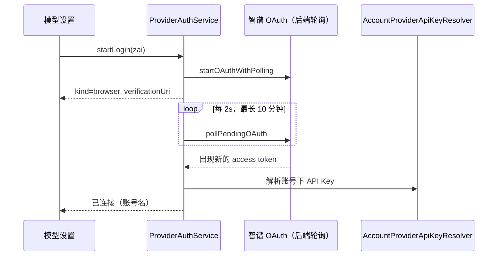

# Provider 认证抽象（ProviderAuth）与 xAI 账号登录

## 目标

- 认证凭据归属于具体 provider（如 `provider-auth:xai`），不再是全局客户端 `user`。
- 一个 provider 可以有多种认证方式，卡片上单选切换，例如 xAI：
  - ○ 使用 xAI / SuperGrok 账号（RFC 8628 Device Code OAuth）
  - ○ 使用 API Key
- 同一抽象后续承载 Anthropic OAuth、OpenAI OAuth、GitHub Copilot，以及智谱账号（C 期迁移）。

## 概念边界

| 概念                         | 含义                                                           | 本期                                |
| ---------------------------- | -------------------------------------------------------------- | ----------------------------------- |
| xAI Device OAuth             | `xai` provider 的一种认证方式；ZCode Agent 仍直接调用 xAI 模型 | 实现                                |
| `grok-build-0.1` 等模型      | `xai` provider 下的普通模型 id                                 | 模型列表按账号实际可用拉取          |
| Grok Build（官方 CLI Agent） | 独立 Agent 产品，可通过 ACP 接入其他应用                       | 不做；如需接入走外部 ACP Agent 通道 |

## 数据模型

```text
Provider 配置（provider_config.json，不含密钥）
  access = { type: "api-key", apiKey }
         | { type: "provider-oauth", authProviderId }      ← 新增，只是引用

凭据（credentials.json，加密）
  key   = "provider-auth:<authProviderId>"
  value = { access, refresh, expiresAt, idToken?, account?: { email?, subject? } }
```

`authProviderId` 首期只有 `xai`。

## 状态所有者

| 状态                              | 所有者                                                   |
| --------------------------------- | -------------------------------------------------------- |
| provider 采用哪种认证方式         | Provider 配置 `access.type`（ProviderConfigService）     |
| OAuth token 与刷新                | Host 进程的 `ProviderAuthService`（凭据文件 + 文件锁）   |
| 登录流程进度（device code、轮询） | `ProviderAuthService` 内存中的 login session，UI 只读    |
| 请求期鉴权材料                    | 每次模型请求 attempt 前由 CLI 向 Host 索取，CLI 不持久化 |

## 时序

```text
【登录】
UI ─startLogin("xai")──────────────▶ ProviderAuthService
                                      POST auth.x.ai/oauth2/device/code
UI ◀─{loginId, userCode, verificationUri(Complete), expiresAt}
UI 打开 verificationUriComplete，展示 userCode
UI ─awaitLogin(loginId)（长等待）──▶  轮询 auth.x.ai/oauth2/token
                                      authorization_pending → 继续；slow_down → 间隔 +5s
                                      access_denied / expired_token / 超时 → 失败
                                      成功 → 写 provider-auth:xai → 广播 provider-auth:changed
UI ◀─{status: "connected", account}
UI 把 provider access 切到 { type: "provider-oauth", authProviderId: "xai" }

【模型请求】
CLI runner（access.type = provider-oauth）
  → ProviderRuntimeHeadersPort.refreshBeforeModelRequest({ providerAuth: { authProviderId } })
  → 协议 interactionRequestProviderRuntimeHeaders
  → Host ProviderAuthService.resolveRequestAuth("xai")
       未过期 → 直接返回
       距过期 ≤120s 或 JWT exp 将到 → single-flight 刷新：
         进程内合并同一 Promise；跨进程用凭据文件锁，拿锁后重读，仍需刷新才请求
         refresh_token 轮换后原子写回
  ← { headersApplied: true, requestAuth: { apiKey: <access_token> } }
  → CLI 以 Authorization: Bearer 发往 api.x.ai
```

## 失败语义

- 未登录或 refresh 失败：Host 返回 `headersApplied: false` 与明确错误；UI 卡片显示「需要重新登录」。
- 刷新失败不清除凭据文件，避免网络抖动导致掉登录；只有 `invalid_grant` 才标记失效。
- 登出：删除 `provider-auth:<id>`，provider access 保持 `provider-oauth`，状态变为未连接。

## 暂不包含

- 远程工作区（SSH/WSL）的凭据同步：远端 Host 暂不可用 xAI 账号方式，后续扩展 providerProvisioning。
- 独立 CLI（无 Host）模式：返回明确错误，提示使用 API Key 或在 ZCode 桌面/Web 中登录。

## 后续期

- B 期：仓库内置预置 provider 清单；模型设置分「预置供应商 / 自定义供应商」。
- C 期：智谱 Z.ai / BigModel 账号登录迁入 ProviderAuthService，与 xAI 同构。

## 验收

- xAI 卡片可在「账号 / API Key」间切换；账号方式完成设备码登录后能正常对话。
- access token 过期后下一次请求自动刷新，多窗口并发请求只刷新一次。
- 登出后请求返回可读错误，不崩溃。

---

# B 期：预置供应商清单与模型设置结构

## 数据来源

- 连接地址、接口格式、模型元数据：只来自仓库打包的 `config/provider/zcode-builtin.json`。
  Host 与独立 CLI 的远端同步 `fetchRelease` 固定返回 `null`，不再从 CDN 覆盖。
- 修改该文件时必须提升 `revision`：本地若缓存过更高 revision 的旧远端配置，会优先于打包文件生效。
- 预置展示清单：`packages/ui/src/settings/model-provider-section/presetProviderCatalog.ts`，
  只声明「哪些模板常驻展示、显示名、支持的认证方式」。

## 模型设置结构

```text
预置供应商
  Z.ai / BigModel（账号套餐，C 期改造）
  Kimi · MiniMax · DeepSeek · 百炼（中国/国际） · Xiaomi MiMo · OpenAI · Anthropic · xAI · OpenRouter · OpenCode Zen · OpenCode Go
自定义供应商
  用户经「新建供应商」创建：OpenAI Compatible（Chat / Responses）、Anthropic Compatible、更多模板
```

- 预置项常驻，未配置时不写入个人配置、不显示状态点；填写 API Key 或选择账号方式时才按模板创建。
- 每个预置模板认领展示顺序中第一个同模板的个人 provider，其余同模板 provider 归入自定义。
- 预置节点 key 为 `catalog:<entryId>`，创建期间节点始终存在；外部按 providerId 定位（`custom:<id>`）
  会被导航校正到认领它的预置节点，避免兜底跳转到第一个供应商。
- 「更多模板」列出未进入预置清单的模板（其他接口格式的 OpenCode、智谱 API Key 模板），保证模板都可创建。

---

# C 期：智谱套餐降级为普通 Provider

## 范围

- 删除界面入口：Start Plan、Team Plan、闲时任务、套餐购买/升级、权益与额度卡片、额度重置、
  客户端欢迎登录页；对应 i18n 文案一并删除。
- 内置配置删除 8 个 `account:*` 套餐连接（个人/团队 Coding Plan、Start Plan、闲时），revision 升至 31。
- Z.ai / BigModel 作为预置供应商，支持「账号登录」与「API Key」两种方式，账号方式走 ProviderAuth。
- 后端套餐、闲时、账号供应商服务代码暂不删除（与跨环境配置同步、动态工作流配置交织），
  界面不再有入口，内置配置不再下发套餐连接，处于闲置状态；后续单独清理。

## 智谱账号登录（ProviderAuth adapter：`zai` / `bigmodel`）

账号登录本质是「自动获取 API Key」，凭据存为 `provider-auth:<zai|bigmodel>`，请求期作为 Bearer 下发。



- 登录完成以「出现与登录前不同的 access token」判定，桌面 deep link 与后端轮询两条路径都能识别。
- API Key 不过期，`expiresAt` 取 `Number.MAX_SAFE_INTEGER`，不走刷新分支。
- 登出同时清理智谱 OAuth 登录态（会话分享、官方 MCP 共用该登录态）。

## 官方 MCP 凭据

- 旧逻辑要求 Registry 中恰有一个 `zhipu-account` Coding Plan 连接；套餐连接删除后改为直接使用
  当前智谱账号登录态（`oauth:active_provider`、`zcodejwttoken`、MaaS JWT），scope 固定为 PERSONAL。
- 套餐是否可用由服务端按账号判定；前后两次读取凭据不一致时整轮重来，不拼接两代凭证。
- 未登录或 MaaS JWT 缺失返回 `official_auth_unavailable`。
